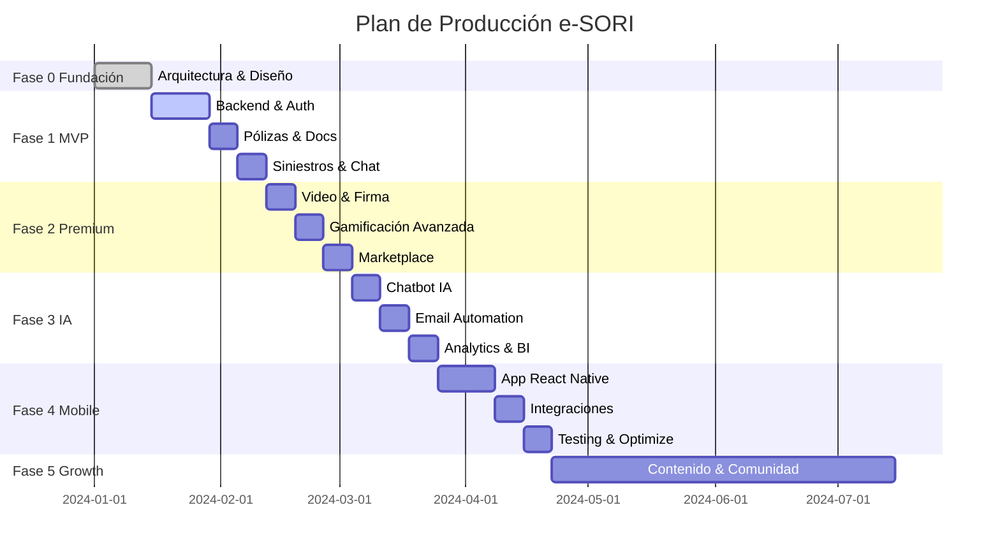

# 🚀 PLAN DE PRODUCCIÓN E-SORI
## Portal de Cliente Soriano Mediadores de Seguros

---

## 📋 ÍNDICE
1. [Visión General](#visión-general)
2. [Stack Tecnológico](#stack-tecnológico)
3. [Fases de Desarrollo](#fases-de-desarrollo)
4. [Cronograma](#cronograma)
5. [Equipo Necesario](#equipo-necesario)
6. [Presupuesto Estimado](#presupuesto-estimado)
7. [KPIs por Fase](#kpis-por-fase)

---

## 🎯 VISIÓN GENERAL

**e-SORI** es el portal digital exclusivo para clientes de Soriano Mediadores de Seguros que permite:
- Gestión completa de pólizas
- Tramitación de siniestros 24/7
- Comunicación directa con mediadores
- Sistema de gamificación para engagement
- Educación financiera en seguros
- Programa de fidelización y referidos

**NO ES**: Un comparador de seguros ni un agregador. Es un portal B2C propietario.

---

## 🛠 STACK TECNOLÓGICO

### Frontend
- **Framework**: Next.js 14 (App Router)
- **UI**: React 18 + TypeScript
- **Estilos**: Tailwind CSS
- **State**: Zustand
- **Forms**: React Hook Form + Zod
- **Charts**: Recharts
- **Animaciones**: Framer Motion (optimizado)

### Backend
- **API**: Next.js API Routes
- **Base de Datos**: PostgreSQL (Supabase)
- **ORM**: Prisma
- **Auth**: NextAuth.js
- **Storage**: Supabase Storage
- **Email**: SendGrid / Resend
- **SMS**: Twilio

### Integraciones
- **Pagos**: Stripe Connect
- **Firma Digital**: DocuSign API
- **Chat**: Pusher / Ably
- **Videollamadas**: Daily.co / Whereby
- **Push Notifications**: OneSignal
- **Analytics**: PostHog / Mixpanel
- **CRM**: Webhook a sistema Soriano existente

### Infraestructura
- **Hosting**: Vercel (Frontend + API)
- **DB**: Supabase (PostgreSQL managed)
- **CDN**: Vercel Edge Network
- **Monitoring**: Sentry + Vercel Analytics
- **Backups**: Supabase automated backups

---

## 📅 FASES DE DESARROLLO

## **FASE 0: FUNDACIÓN (2 semanas)**
*Estado: ✅ COMPLETADO*

### Entregables
- [x] Arquitectura base Next.js 14
- [x] Diseño UI/UX completo
- [x] Sistema de navegación
- [x] Dark mode
- [x] Páginas principales (maqueta)
- [x] Sistema de gamificación básico
- [x] Motor de análisis de coberturas

### Métricas
- Tiempo de carga: < 2s
- Lighthouse Score: > 90
- Páginas completadas: 12

---

## **FASE 1: CORE MVP (4 semanas)**
*Objetivo: Sistema funcional básico en producción*

### Semana 1-2: Backend & Autenticación

#### Base de Datos (Prisma + PostgreSQL)
```prisma
// Esquema completo
model User {
  id            String   @id @default(cuid())
  email         String   @unique
  name          String
  phone         String?
  avatarUrl     String?
  createdAt     DateTime @default(now())

  // Gamificación
  xp            Int      @default(0)
  coins         Int      @default(0)
  level         String   @default("BRONCE")
  streak        Int      @default(0)

  // Relaciones
  policies      Policy[]
  claims        Claim[]
  documents     Document[]
  notifications Notification[]
  quizResults   QuizResult[]
  referrals     Referral[]

  // Perfil de riesgo
  riskProfile   RiskProfile?
}

model Policy {
  id            String   @id @default(cuid())
  userId        String
  user          User     @relation(fields: [userId], references: [id])

  type          String   // AUTO, HOGAR, VIDA, SALUD
  company       String
  policyNumber  String   @unique
  startDate     DateTime
  endDate       DateTime
  premium       Float
  coverage      Json     // Detalles de cobertura
  status        String   // ACTIVE, EXPIRED, CANCELLED

  documents     Document[]
  claims        Claim[]
  reminders     Reminder[]

  createdAt     DateTime @default(now())
  updatedAt     DateTime @updatedAt
}

model Claim {
  id            String   @id @default(cuid())
  userId        String
  user          User     @relation(fields: [userId], references: [id])
  policyId      String
  policy        Policy   @relation(fields: [policyId], references: [id])

  claimNumber   String   @unique
  type          String   // ACCIDENT, THEFT, DAMAGE, HEALTH, etc.
  date          DateTime
  description   String
  amount        Float?
  status        String   // PENDING, IN_PROGRESS, APPROVED, REJECTED, PAID

  documents     Document[]
  messages      ClaimMessage[]

  createdAt     DateTime @default(now())
  updatedAt     DateTime @updatedAt
}

model Document {
  id            String   @id @default(cuid())
  userId        String
  user          User     @relation(fields: [userId], references: [id])
  policyId      String?
  policy        Policy?  @relation(fields: [policyId], references: [id])
  claimId       String?
  claim         Claim?   @relation(fields: [claimId], references: [id])

  name          String
  type          String   // PDF, IMAGE, DOC
  category      String   // POLICY, CLAIM, ID, PROOF
  url           String
  size          Int

  createdAt     DateTime @default(now())
}

model RiskProfile {
  id            String   @id @default(cuid())
  userId        String   @unique
  user          User     @relation(fields: [userId], references: [id])

  // Personal
  age           Int
  occupation    String
  income        String
  maritalStatus String
  children      Int

  // Vivienda
  housingType   String
  housingStatus String   // OWNER, RENTER
  squareMeters  Int?
  hasMortgage   Boolean

  // Vehículo
  hasVehicle    Boolean
  vehicleBrand  String?
  vehicleModel  String?
  vehicleYear   Int?

  // Salud
  healthStatus  String
  smoker        Boolean

  // Calculado
  riskScore     Float
  recommendations Json

  updatedAt     DateTime @updatedAt
}

model Notification {
  id            String   @id @default(cuid())
  userId        String
  user          User     @relation(fields: [userId], references: [id])

  type          String   // REMINDER, ACHIEVEMENT, MESSAGE, CLAIM_UPDATE
  title         String
  message       String
  read          Boolean  @default(false)
  actionUrl     String?

  createdAt     DateTime @default(now())
}

model Reminder {
  id            String   @id @default(cuid())
  policyId      String
  policy        Policy   @relation(fields: [policyId], references: [id])

  type          String   // RENEWAL, PAYMENT, DOCUMENT
  date          DateTime
  sent          Boolean  @default(false)

  createdAt     DateTime @default(now())
}

model QuizResult {
  id            String   @id @default(cuid())
  userId        String
  user          User     @relation(fields: [userId], references: [id])

  quizDate      DateTime
  score         Int
  totalQuestions Int
  answers       Json
  xpEarned      Int
  coinsEarned   Int

  createdAt     DateTime @default(now())
}

model Referral {
  id            String   @id @default(cuid())
  referrerId    String
  referrer      User     @relation(fields: [referrerId], references: [id])

  code          String   @unique
  referredEmail String?
  referredName  String?
  stage         String   // INVITED, INSTALLED, PROFILE_COMPLETE, POLICY_PAID

  coinsAwarded  Int      @default(0)
  xpAwarded     Int      @default(0)

  createdAt     DateTime @default(now())
  updatedAt     DateTime @updatedAt
}

model ClaimMessage {
  id            String   @id @default(cuid())
  claimId       String
  claim         Claim    @relation(fields: [claimId], references: [id])

  senderId      String   // User ID or "MEDIATOR"
  senderName    String
  message       String
  attachments   Json?

  createdAt     DateTime @default(now())
}
```

#### APIs Esenciales
```typescript
// /api/auth/*             - NextAuth.js
// /api/policies           - CRUD pólizas
// /api/claims             - CRUD siniestros
// /api/documents/upload   - Subir archivos
// /api/notifications      - SSE notificaciones
// /api/quiz/daily         - Quiz diario
// /api/referrals          - Programa referidos
// /api/user/profile       - Perfil usuario
```

### Semana 3: Gestión de Pólizas & Documentos

#### Features
- **Lista de pólizas** con filtros y búsqueda
- **Detalle de póliza** con toda la info
- **Subida de documentos** (drag & drop)
- **Visor de PDFs** inline
- **Descarga masiva** de documentos
- **Alertas de vencimiento** automáticas
- **Timeline** de eventos de póliza

#### Endpoints
```typescript
// GET /api/policies
// GET /api/policies/[id]
// POST /api/policies/[id]/documents
// GET /api/documents/[id]/download
// POST /api/reminders/configure
```

### Semana 4: Siniestros & Chat

#### Sistema de Siniestros
- **Formulario guiado** paso a paso
- **Subida de fotos** del siniestro
- **Tracking en tiempo real** del estado
- **Chat con mediador** integrado
- **Notificaciones push** de actualizaciones

#### Chat en Tiempo Real (Pusher)
```typescript
// Channels:
// - private-claim-{claimId}  (Usuario + Mediador)
// - private-user-{userId}    (Notificaciones)

// Events:
// - message.new
// - claim.status-changed
// - document.uploaded
```

### Testing & Deploy
- Tests unitarios (Jest)
- Tests E2E críticos (Playwright)
- Deploy a staging
- User testing interno

---

## **FASE 2: EXPERIENCIA PREMIUM (3 semanas)**
*Objetivo: Diferenciación y engagement*

### Semana 5: Videollamadas & Firma Digital

#### Videollamadas (Daily.co)
```typescript
// /api/meetings/create
// /api/meetings/[id]/join

// Features:
- Reserva de citas con calendario
- Recordatorios automáticos (email + SMS)
- Grabación de sesiones (opcional)
- Screen sharing para documentos
- Transcripción automática
```

#### Firma Digital (DocuSign)
```typescript
// /api/documents/[id]/sign
// /api/documents/[id]/sign-status

// Flujo:
1. Mediador sube documento
2. Usuario recibe notificación
3. Firma con eSignature
4. PDF firmado se guarda automáticamente
```

### Semana 6: Gamificación Avanzada

#### Expansión del Sistema
- **200+ preguntas** en base de datos
- **Dificultad adaptativa** (ML básico)
- **Torneos mensuales** con premios reales
- **Retos semanales** temáticos
- **Tabla de clasificación** de amigos
- **Logros desbloqueables** con badges visuales
- **Tienda de avatares** (personalización)

#### Mecánicas Nuevas
```typescript
// Combo System
- Respuestas consecutivas correctas = bonus XP
- Racha perfecta de 7 días = 500 coins

// Social
- Desafiar amigos a duelo de quiz
- Compartir logros en RRSS

// Eventos
- Quiz especial "Black Friday" con 10x coins
- "Mes del hogar" con preguntas temáticas
```

### Semana 7: Marketplace & Recompensas

#### Integración Stripe
```typescript
// Flujo de canje:
1. Usuario selecciona recompensa
2. Validación de coins
3. Pago a partner (Stripe Connect)
4. Generación de código/cupón
5. Email con instrucciones
```

#### Recompensas Reales
- **Vales Amazon** (10€, 25€, 50€)
- **Servicios Soriano** (revisión premium, consultoría)
- **Partners locales** (talleres, ópticas, gimnasios)
- **Experiencias** (cenas, spa, actividades)
- **Descuentos en pólizas** (10% renovación)

---

## **FASE 3: INTELIGENCIA & AUTOMACIÓN (3 semanas)**
*Objetivo: Reducir carga operativa*

### Semana 8: Chatbot IA

#### Stack IA
- **OpenAI GPT-4** para conversación
- **Pinecone** para vector search (KB)
- **LangChain** para orchestration

#### Capacidades
```typescript
// El chatbot puede:
- Responder FAQs sobre seguros
- Explicar coberturas de pólizas
- Guiar proceso de siniestro
- Recomendar productos según perfil
- Agendar citas con mediador
- Escalar a humano si es necesario

// KB incluye:
- Términos de seguros (glosario)
- Procedimientos Soriano
- Legislación española seguros
- Casos de uso comunes
```

### Semana 9: Email Automation & Workflows

#### Secuencias Automáticas (SendGrid)
```typescript
// 1. Onboarding (7 días)
Day 0: Bienvenida + próximos pasos
Day 1: Tutorial de funcionalidades
Day 3: Recordar completar perfil de riesgo
Day 5: Invitación a primer quiz
Day 7: Programa de referidos

// 2. Engagement (mensual)
- Resumen de actividad del mes
- Nuevos logros conseguidos
- Sugerencias personalizadas
- Contenido educativo relevante

// 3. Retención
- Re-engagement de inactivos (7 días sin login)
- Recordatorio de coins acumulados
- Ofertas especiales marketplace

// 4. Vencimientos
- 60 días antes: "Tu póliza vence pronto"
- 30 días antes: "Renueva ahora y gana 100 coins"
- 15 días antes: "Última oportunidad"
- 7 días antes: "Urgente: renovar póliza"
```

### Semana 10: Analytics & Business Intelligence

#### Dashboard Mediadores
```typescript
// Métricas en tiempo real:
- Usuarios activos (DAU/MAU)
- Pólizas por vencer este mes
- Siniestros pendientes de respuesta
- Conversion rate perfil → póliza
- NPS score
- Engagement rate (quizzes, logins)
- Referral funnel

// Alertas automáticas:
- Cliente con baja actividad (riesgo churn)
- Póliza sin renovar 7 días después del vencimiento
- Siniestro sin respuesta en 24h
- Usuario con 1000+ coins sin canjear
```

---

## **FASE 4: MOBILE & SCALE (4 semanas)**
*Objetivo: Alcance masivo*

### Semana 11-12: App Móvil Nativa

#### React Native App
```typescript
// Features específicas mobile:
- Face ID / Touch ID para login
- Push notifications nativas
- Modo offline (sync cuando vuelva conexión)
- Cámara integrada para subir docs
- Escaneo OCR de pólizas (Google ML Kit)
- Geolocalización para servicios cercanos
- Widget de "Días sin siniestro"
- Deep linking desde emails/SMS
```

#### PWA Optimizada
```typescript
// Service Worker
- Cache first para assets
- Network first para API calls
- Background sync para uploads
- Add to home screen prompt
- Installable desde navegador
```

### Semana 13: Integraciones Externas

#### Google Calendar
```typescript
// Sincronización automática:
- Vencimientos de pólizas
- Citas con mediador
- Recordatorios de pago
- Eventos del programa de fidelización
```

#### Apple Wallet / Google Pay
```typescript
// Tarjetas digitales:
- Póliza de auto con código QR
- Tarjeta de salud
- Tarjeta de fidelización (coins balance)
```

#### WhatsApp Business API
```typescript
// Notificaciones bidireccionales:
- Envío de estados de siniestro
- Respuestas a consultas simples
- Recordatorios de vencimiento
- Link a chat in-app
```

### Semana 14: Optimización & Testing

#### Performance
- Code splitting avanzado
- Image optimization (WebP, lazy load)
- Database query optimization
- CDN para assets estáticos
- Redis cache para API responses

#### Testing
- Test suite completo (>80% coverage)
- Load testing (Artillery)
- Security audit (OWASP)
- Accessibility audit (WCAG 2.1 AA)
- Pen testing (HackerOne)

---

## **FASE 5: CRECIMIENTO & COMUNIDAD (Ongoing)**
*Objetivo: Viralidad y retención*

### Contenido Educativo

#### Blog Integrado
```typescript
// Categorías:
- Educación financiera
- Casos de éxito
- Novedades del sector
- Tips de prevención
- Actualidad legislativa

// SEO:
- 2 artículos/semana
- 1500-2000 palabras
- Optimización para long-tail keywords
- Link building interno
```

#### Videotutoriales
```typescript
// Temas:
- "Cómo declarar un siniestro en 5 minutos"
- "Entiende tu póliza de auto"
- "Qué hacer en caso de accidente"
- "Maximiza tu cobertura de hogar"
- "Seguros de vida: ¿cuánto necesitas?"

// Formato:
- 3-5 minutos
- Captions en español
- Hosting en YouTube + embed
- Transcripción para SEO
```

#### Calculadoras Interactivas
```typescript
// Herramientas:
- "¿Cuánto cuesta asegurar mi coche?"
- "Calculadora de ahorro para jubilación"
- "Necesidades de seguro de vida"
- "Protección óptima para tu hogar"

// Features:
- Inputs personalizados
- Gráficos interactivos
- Exportar PDF con resultados
- CTA para contactar mediador
```

### Programa de Afiliados

#### Estructura
```typescript
// Niveles:
1. Básico (0-5 referidos): 50 coins/conversión
2. Plata (6-15): 75 coins/conversión + 5% en coins
3. Oro (16-30): 100 coins/conversión + 10% en coins
4. Platino (31+): 150 coins/conversión + 15% en coins

// Bonos especiales:
- 3 conversiones en un mes: +300 coins
- 10 conversiones totales: Vale Amazon 50€
- Top 10 referrers del año: Experiencia premium
```

### Comunidad

#### Foro / Feedback
```typescript
// Secciones:
- Sugerencias de mejora (upvoting)
- Casos resueltos (testimonios)
- Dudas frecuentes
- Noticias del sector

// Gamificación:
- Respuestas útiles = +10 XP
- Mejor respuesta del mes = +200 coins
```

#### Eventos

```typescript
// Calendario anual:
- Enero: "Mes del ahorro" (descuentos renovaciones)
- Marzo: "Día de la protección familiar" (seguros vida)
- Junio: "Verano seguro" (tips viaje)
- Septiembre: "Vuelta al cole" (seguros salud)
- Noviembre: "Black Friday" (recompensas 2x)
```

---

## 📊 CRONOGRAMA GLOBAL



**Duración total: ~16 semanas (4 meses)**

---

## 👥 EQUIPO NECESARIO

### Core Team (Fase 1-4)
| Rol | Cantidad | Dedicación | Responsabilidad |
|-----|----------|------------|-----------------|
| **Tech Lead / Fullstack Sr** | 1 | 100% | Arquitectura, code reviews, decisiones técnicas |
| **Frontend Developer** | 1 | 100% | UI/UX, componentes, optimización |
| **Backend Developer** | 1 | 100% | APIs, base de datos, integraciones |
| **Mobile Developer** | 1 | 50% (Fase 4) | React Native app |
| **UI/UX Designer** | 1 | 50% | Diseño de flujos, mockups, assets |
| **QA Engineer** | 1 | 50% | Tests manuales, automatización |
| **Product Manager** | 1 | 50% | Roadmap, priorización, stakeholders |
| **DevOps** | 1 | 25% | CI/CD, monitoreo, incidencias |

### Extended Team (Fase 5)
| Rol | Cantidad | Dedicación |
|-----|----------|------------|
| **Content Writer** | 1 | 50% |
| **Video Producer** | 1 | 25% |
| **Growth Marketer** | 1 | 100% |
| **Data Analyst** | 1 | 50% |

---

## 💰 PRESUPUESTO ESTIMADO

### Desarrollo (Fases 1-4)
| Concepto | Coste |
|----------|-------|
| Equipo desarrollo (4 meses) | 60.000€ - 80.000€ |
| Herramientas & SaaS | 2.000€ - 3.000€ |
| Infraestructura (staging + prod) | 1.500€ - 2.500€ |
| Licencias & APIs (OpenAI, DocuSign, etc.) | 3.000€ - 5.000€ |
| **TOTAL DESARROLLO** | **66.500€ - 90.500€** |

### Operación (Mensual post-launch)
| Concepto | Coste/mes |
|----------|-----------|
| Hosting (Vercel Pro) | 200€ |
| Base de datos (Supabase) | 100€ - 250€ |
| APIs (OpenAI, Twilio, SendGrid) | 300€ - 500€ |
| Pusher (chat) | 50€ - 150€ |
| Daily.co (video) | 100€ - 200€ |
| Monitoring (Sentry, PostHog) | 100€ |
| Backups & Storage | 50€ |
| **TOTAL MENSUAL** | **900€ - 1.450€** |

### Marketing & Growth (Año 1)
| Concepto | Coste |
|----------|-------|
| Google Ads | 12.000€ |
| Facebook / Instagram Ads | 8.000€ |
| SEO & Content | 6.000€ |
| Email marketing | 1.200€ |
| Recompensas marketplace (subsidio) | 5.000€ |
| **TOTAL MARKETING** | **32.200€** |

**INVERSIÓN TOTAL AÑO 1: ~110.000€ - 140.000€**

---

## 📈 KPIS POR FASE

### Fase 1 (MVP)
- **Objetivo**: Validar producto
- Usuarios registrados: 100
- Pólizas cargadas: 150
- Siniestros tramitados: 10
- NPS: > 40
- Bugs críticos: 0

### Fase 2 (Premium)
- **Objetivo**: Engagement
- DAU/MAU: > 35%
- Quizzes completados/usuario: 3
- Recompensas canjeadas: 50
- Videollamadas realizadas: 20
- Documentos firmados: 30

### Fase 3 (IA)
- **Objetivo**: Eficiencia
- Tiempo respuesta mediador: < 2h
- Consultas resueltas por IA: 60%
- Emails abiertos: > 35%
- CTR en emails: > 5%
- Conversiones from email: > 2%

### Fase 4 (Mobile)
- **Objetivo**: Alcance
- Descargas app: 500
- Usuarios activos mobile: 60%
- Tasa retención D7: > 40%
- Tasa retención D30: > 25%
- Push opt-in rate: > 60%

### Fase 5 (Growth)
- **Objetivo**: Escala
- Usuarios totales: 2.000
- MRR (ingresos recurrentes): 5.000€
- CAC (coste adquisición): < 50€
- LTV (lifetime value): > 500€
- Viral coefficient (K): > 0.5
- Churn rate: < 5%

---

## 🔐 SEGURIDAD & COMPLIANCE

### Normativa
- **GDPR**: Cumplimiento total (consentimientos, portabilidad, derecho al olvido)
- **LOPD**: Adaptación legislación española
- **LSSICE**: Ley de Servicios de Sociedad de la Información
- **PSD2**: Pagos seguros (SCA)

### Medidas Técnicas
- SSL/TLS encryption (end-to-end)
- Hashing passwords (bcrypt)
- Rate limiting en APIs
- SQL injection prevention (Prisma)
- XSS protection
- CSRF tokens
- Backups diarios automáticos
- Disaster recovery plan
- Penetration testing anual

---

## 🚀 GO-TO-MARKET

### Pre-lanzamiento (4 semanas antes)
1. **Landing page** con waitlist
2. **Video explicativo** de 90 segundos
3. **Early access** a 50 clientes actuales
4. **Beta testing** con incentivos (500 coins)

### Lanzamiento (Semana 1)
1. **Email masivo** a base de datos Soriano (10.000+)
2. **RRSS** (LinkedIn, Facebook, Instagram)
3. **Nota de prensa** en medios locales
4. **Evento presencial** en oficinas Soriano

### Crecimiento (Meses 2-3)
1. **Google Ads** (keywords long-tail)
2. **Facebook Ads** (lookalike audiences)
3. **Partnerships** con talleres, concesionarios
4. **Referral program** (2x coins en primeras 4 semanas)

### Consolidación (Meses 4-6)
1. **Content marketing** (blog SEO-optimizado)
2. **Email nurturing** de leads
3. **Webinars** educativos
4. **PR** en medios sector seguros

---

## ✅ CHECKLIST DE PRODUCCIÓN

### Pre-deployment
- [ ] Tests E2E pasando (100%)
- [ ] Lighthouse score > 90
- [ ] Security audit completado
- [ ] Backup strategy verificada
- [ ] Monitoring configurado
- [ ] Error tracking activo
- [ ] Analytics implementado
- [ ] Terms & Conditions redactados
- [ ] Privacy Policy publicada
- [ ] GDPR compliance verificado

### Post-deployment
- [ ] Smoke tests en producción
- [ ] SSL certificate verificado
- [ ] DNS correctamente configurado
- [ ] Email delivery funcionando
- [ ] SMS delivery funcionando
- [ ] Pagos (Stripe) en modo live
- [ ] Backups automáticos activos
- [ ] Alertas configuradas (PagerDuty)
- [ ] Runbook documentado
- [ ] Equipo de soporte preparado

---

## 📞 CONTACTO & SOPORTE

### Equipo Técnico
- **Tech Lead**: [email]
- **Product Manager**: [email]
- **Soporte**: soporte@e-sori.es
- **Urgencias**: +34 XXX XXX XXX

### Horarios
- **Lunes a Viernes**: 9:00 - 18:00
- **Soporte crítico**: 24/7 (on-call)
- **SLA**: Respuesta < 4h (días laborables)

---

## 📝 DOCUMENTACIÓN

### Técnica
- [Arquitectura](./docs/architecture.md)
- [API Reference](./docs/api.md)
- [Database Schema](./docs/schema.md)
- [Deployment Guide](./docs/deployment.md)

### Usuario
- [Guía de Usuario](./docs/user-guide.md)
- [FAQs](./docs/faqs.md)
- [Video Tutoriales](./docs/videos.md)

---

**Última actualización**: 27 Enero 2026
**Versión**: 1.0
**Próxima revisión**: 27 Febrero 2026
